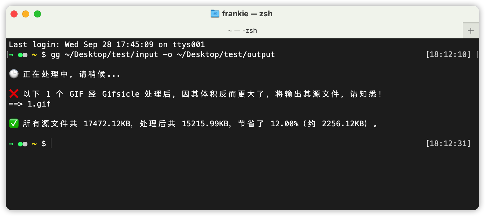

# 说明

一个基于 [Gifsicle](https://www.lcdf.org/gifsicle/man.html)，可批量「无损压缩」 GIF 图片的 Shell 命令行工具。

## 简单使用

尽说基于 Shell 脚本编写，但为了便于安装，于是做成了 NPM 包形式。

```shell
# 全局安装
$ npm i -g https://github.com/toFrankie/gif-optimize.git

# 使用
$ gg <input-dir> -o <output-dir>
```

由于没想到更合适的命名，暂定 CLI 命令为 `gg` 吧，可能多少有点随便哈。
目前仅接受「输入」与「输出」两个参数，其中 `-o`、`--output` 表示输出目录（路径）。其余参数均表示输入目录（路径）。输入可以是目录或文件，若是目录，则会遍历目录下所有 GIF 文件（不含子目录）。



## 其他

> 注意，由于部分 GIF 经 Gifsicle 处理后，体积反而会变大，此时会将源文件输出。
